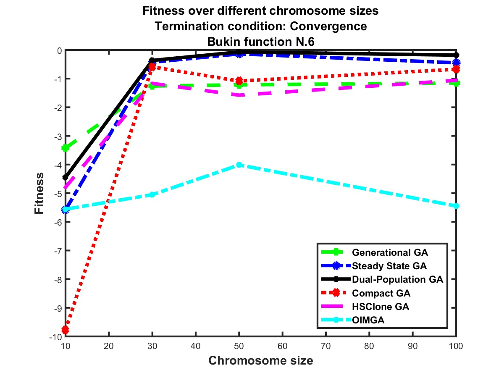

# Dual-Population Genetic Algorithm
This repository hosts MATLAB implementation of dual-population genetic algorithm to verify its functionalities. It is a variation of steady-state genetic algorithm, suitable for pipeline processing on hardware implementations of genetic algorithm.

## Description
Detailes about dual-population genetic algorithm can be found in our published paper ([pdf](docs/CEC-2017.pdf) or [IEEE Xplore](https://doi.org/10.1109/CEC.2017.7969612)).

An opportunity in a high speed parallel processing of genetic algorithm (GA) is the ability to pipeline its serial operations, such as selection, reproduction, fitness calculation, and replacement. In the context of steady-state genetic algorithm, selection and replacement take place every iteration. Since they will require access to memory at the same time in a pipeline mode, there is a natural difficulty in parallelizing selection and replacement in steady-state GA. The general goal of the dual-population scheme is to make it possible to perform selection and replacement simultaneously to increase computation speed. It is done by defining two populations with one used for selection and the other for replacement in any iteration, whereas they switch their roles in the next iteration. The pseudo-code of dual-population GA is:
```
Initialize two identical populations, with index i: for i={0, 1}
i=0 
While termination condition not met
    Select two chromosomes from population i
    Do Crossover probabilistically
    Mutate probabilistically
    Evaluate fitness values of offspring
    Flip i
    Replace the two offspring on population i
End While 
Output the best-found individual
```

In a hardware setting, dual-population GA speeds up genetic operations 34% on average compared to the conventional steady-state GA. In comparison to other GA types and some hardware-oriented GAs, its optimization characteristics is good and is similar to steady-state GA as shown in a sample test condition below:
<p align="center">
  
</p>

## The code
The code provides the MATLAB implementation of dual-population GA and some other GA variants for the sake of comparison. Dual-population GA is written in two modes: with delete-the-worst replacement and with delete-the-oldest replacement. Other implemented genetic algorithms are: steady-state, generational, Compact GA, Optimal Individual Monogenetic Algorithm (OIMGA), and Half Sibling and a Clone (HSClone). They are all placed in the *ga* folder. The folder *tests* contains the MATLAB codes to test the implemented genetic algorithm methods and plot the results. They are stored in a separate directory from the files in the *ga* folder for clarity, but to run the test files, the files inside the *ga* folder should be present in the working directory as well. The test fitness functions can be seen [here](docs/test-functions.pdf).

# Citation
You may refer to our work by citing our [paper](https://doi.org/10.1109/CEC.2017.7969612).
```
@inproceedings{alinodehi2017modified,
  title={A modified steady state genetic algorithm suitable for fast pipelined hardware},
  author={Alinodehi, S Pourya Hoseini and Louis, Sushil J and Moshfe, Sajjad and Nicolescu, Mircea},
  booktitle={2017 IEEE Congress on Evolutionary Computation (CEC)},
  pages={2526--2533},
  year={2017},
  organization={IEEE}
}
```

# Developers
[Pourya Hoseini](https://github.com/pouryahoseini)

# Contact
I can be reached at hoseini@nevada.unr.edu.
